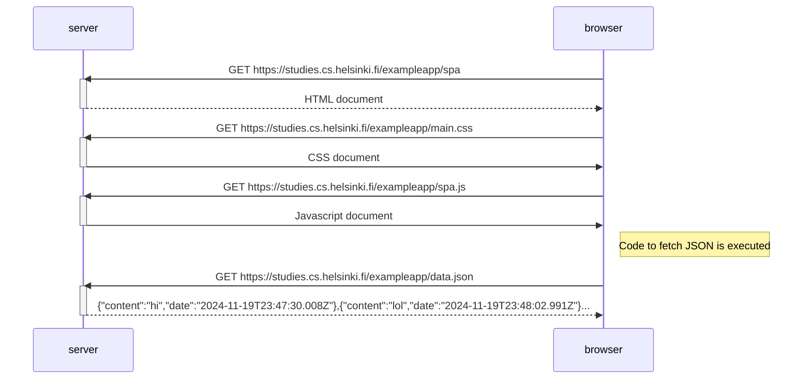

```mermaid
sequenceDiagram
    participant server
    participant browser

    browser->>server: GET https://studies.cs.helsinki.fi/exampleapp/spa
    activate server
    server-->>browser: HTML document
    deactivate server

    browser->>server: GET https://studies.cs.helsinki.fi/exampleapp/main.css
    activate server
    server->>browser: CSS document
    deactivate server

    browser->>server: GET https://studies.cs.helsinki.fi/exampleapp/spa.js
    activate server
    server->>browser: Javascript document
    deactivate server

    Note right of browser: Code to fetch JSON is executed

    browser->>server: GET https://studies.cs.helsinki.fi/exampleapp/data.json
    activate server
    server-->>browser:{"content":"hi","date":"2024-11-19T23:47:30.008Z"},{"content":"lol","date":"2024-11-19T23:48:02.991Z"}...
    deactivate server
```
